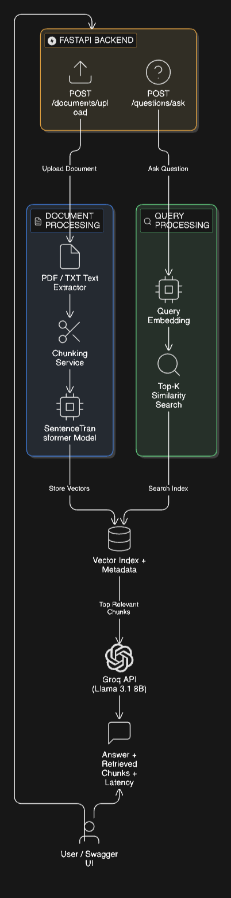

<div align="center">

# 📄 RAG-Based Question Answering System

**Retrieval-Augmented Generation · FastAPI · FAISS · Groq · Llama 3.1**

[](https://python.org)
[](https://fastapi.tiangolo.com)
[](https://github.com/facebookresearch/faiss)
[](https://groq.com)
[](LICENSE)

</div>

---

## Overview

A production-ready **Retrieval-Augmented Generation (RAG)** backend that lets you upload documents and ask natural language questions against them — all powered by semantic vector search and Groq's blazing-fast LLM inference.

Built with a clean, modular FastAPI architecture, this system handles everything from document ingestion to context-aware answer generation. Upload a PDF or TXT file, then ask anything: the system retrieves the most relevant chunks from a FAISS index and generates a grounded response using **Llama 3.1 8B Instant** via the Groq API — returning the answer, retrieved context, latency, and model metadata in a single response.

Designed for extensibility, this project is a solid foundation for building domain-specific Q&A tools, document search assistants, or enterprise knowledge bases.

---

## Features

- **Multi-format Document Upload** — supports PDF and TXT files with automatic text extraction
- **Intelligent Text Chunking** — configurable chunking pipeline to split documents into semantically meaningful segments
- **Semantic Embeddings** — generates dense vector representations using `all-MiniLM-L6-v2` via SentenceTransformers
- **FAISS Vector Search** — fast, scalable similarity search across embedded document chunks
- **LLM-Grounded Answers** — uses Groq API with Llama 3.1 8B Instant to generate context-aware, factual responses
- **Rich API Response** — returns `answer`, `retrieved_chunks`, `latency_ms`, and `model_used` for full transparency
- **Interactive Swagger Docs** — auto-generated `/docs` UI for exploring and testing all endpoints
- **Health Check Endpoint** — monitor service status at a glance
- **Clean Modular Architecture** — organized codebase with separation of concerns across ingestion, retrieval, and generation layers

---

## Tech Stack

| Layer | Technology |
|---|---|
| **API Framework** | FastAPI + Uvicorn |
| **Embedding Model** | SentenceTransformers (`all-MiniLM-L6-v2`) |
| **Vector Store** | FAISS (Facebook AI Similarity Search) |
| **LLM Provider** | Groq API |
| **Language Model** | Llama 3.1 8B Instant |
| **Data Validation** | Pydantic |
| **Language** | Python 3.10+ |

---

## Architecture

The system follows a two-phase RAG pipeline — an offline **ingestion flow** and an online **retrieval + generation flow**.



---

## How It Works

### Phase 1 — Document Ingestion

1. User uploads a **PDF or TXT** file via the `/documents/upload` endpoint
2. Text is **extracted** from the document (PyMuPDF for PDFs, plain read for TXT)
3. Extracted text is split into **overlapping chunks** using a configurable chunking pipeline
4. Each chunk is passed through **SentenceTransformers** (`all-MiniLM-L6-v2`) to generate a 384-dimensional embedding vector
5. All embeddings are **indexed into FAISS** for fast similarity lookup
6. Document metadata and status are stored for tracking

### Phase 2 — Question Answering

1. User sends a natural language **question** via `/questions/ask`
2. The question is embedded using the **same SentenceTransformers model**
3. FAISS performs a **top-k vector similarity search** to retrieve the most relevant chunks
4. Retrieved chunks are assembled into a **context prompt** and sent to the Groq API
5. **Llama 3.1 8B Instant** generates a grounded answer based solely on the retrieved context
6. The API returns the **answer**, **retrieved chunks**, **latency in ms**, and **model name**

---

## API Endpoints

| Method | Endpoint | Description |
|---|---|---|
| `GET` | `/` | Root — redirects to Swagger UI |
| `GET` | `/health` | Health check — confirms the service is running |
| `POST` | `/documents/upload` | Upload a PDF or TXT document for ingestion |
| `GET` | `/documents` | List all uploaded and indexed documents |
| `GET` | `/documents/{document_id}/status` | Get processing status for a specific document |
| `POST` | `/questions/ask` | Ask a natural language question against indexed documents |

Full interactive documentation is available at **`/docs`** (Swagger UI) after running the server.

---

## Installation

### Prerequisites

- Python 3.10 or higher
- A valid [Groq API key](https://console.groq.com)

### Steps

```bash
# 1. Clone the repository
git clone https://github.com/VikashITB/rag-question-answering-system.git
cd rag-question-answering-system

# 2. Create and activate a virtual environment
python -m venv venv
source venv/bin/activate        # On Windows: venv\Scripts\activate

# 3. Install dependencies
pip install -r requirements.txt
```

---

## Environment Variables

Create a `.env` file in the project root:

```env
GROQ_API_KEY=your_key_here
```

> **Never commit your `.env` file.** Add it to `.gitignore`.

---

## Run Locally

```bash
uvicorn app.main:app --reload
```

The API will be available at: **`http://127.0.0.1:8000`**

Swagger UI: **`http://127.0.0.1:8000/docs`**

---

## Example Usage

### Ask a Question

**Request:**

```json
POST /questions/ask

{
  "question": "What is this document about?",
  "top_k": 3,
  "document_ids": []
}
```

**Response:**

```json
{
  "answer": "This document is about Artificial Intelligence.",
  "latency_ms": 585.21,
  "model_used": "llama-3.1-8b-instant"
}
```

> `document_ids: []` queries across all indexed documents. Pass specific IDs to scope the search.

---

## Folder Structure

```
rag-question-answering-system/
│
├── app/
│   ├── main.py                  # FastAPI app entry point, mounts all routes
│   │
│   ├── routes/
│   │   ├── documents.py         # Document upload and status routes
│   │   └── questions.py         # Question answering routes
│   │
│   ├── services/
│   │   ├── ingestion.py         # Text extraction and chunking pipeline
│   │   ├── embeddings.py        # SentenceTransformers embedding logic
│   │   ├── vector_store.py      # FAISS index management
│   │   └── llm.py               # Groq API integration
│   │
│   └── models/
│       ├── document.py          # Pydantic schemas for documents
│       └── question.py          # Pydantic schemas for Q&A requests/responses
│
├── tests/                       # Unit and integration tests
│
├── architecture.png             # System architecture diagram
├── requirements.txt
├── .env.example
├── .gitignore
└── README.md
```

---

## Future Improvements

- **Multi-user support** with per-user document namespaces
- **Persistent vector storage** using ChromaDB or Pinecone in place of in-memory FAISS
- **Streaming responses** for real-time token-by-token answer generation
- **Re-ranking layer** using a cross-encoder to improve chunk relevance precision
- **Conversation memory** to support multi-turn, context-aware Q&A sessions
- **Frontend UI** — a minimal React or Streamlit interface for non-technical users
- **Document versioning** to handle updates to previously indexed files
- **Authentication** via API keys or OAuth2 for secure multi-client deployments

---

## Author

**Vikas Gupta**

[](https://github.com/VikashITB)

---

<div align="center">

*Built with FastAPI · FAISS · SentenceTransformers · Groq · Llama 3.1*

</div>